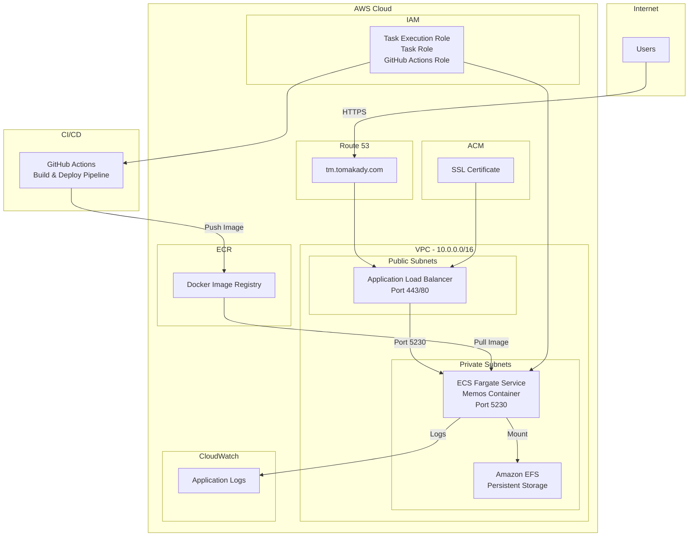

# ECS Memos Deployment Project

A production-ready deployment of [Memos](https://www.usememos.com/) - a modern, open-source knowledge management and note-taking platform - on AWS ECS using Docker, Terraform, and GitHub Actions CI/CD.

## Table of Contents

- [Overview](#overview)
- [Project Architecture](#project-architecture)
- [Features](#features)
- [Project Structure](#project-structure)
- [Prerequisites](#prerequisites)
- [Setup Instructions](#setup-instructions)
- [Application Details](#application-details)
- [Infrastructure Components](#infrastructure-components)
- [CI/CD Pipeline](#cicd-pipeline)
- [Screenshots](#screenshots)
- [Useful Links](#useful-links)

<a id="overview"></a>

## Overview

This project demonstrates a complete production deployment workflow, transitioning from manual AWS setup (ClickOps) to Infrastructure as Code (IaC) with automated CI/CD pipelines. The application is deployed on AWS ECS Fargate with:

- **HTTPS** enabled via AWS Certificate Manager (ACM)
- **Custom domain** (`tm.tomakady.com`) configured with Route 53
- **Containerized** application using Docker
- **Infrastructure as Code** with Terraform
- **Automated deployments** via GitHub Actions
- **Persistent storage** using Amazon EFS

### The Story Behind This Project

This project was completed as part of the **CoderCo ECS Project** - a hands-on learning experience designed to teach real-world cloud deployment skills. The goal was to build, containerize, and deploy an application using Docker, Terraform, and ECS with HTTPS and a custom domain - exactly like a real production workload.

**Key Learning Outcomes:**

- Understanding AWS ECS, ALB, and networking fundamentals
- Transitioning from ClickOps to Infrastructure as Code
- Implementing automated CI/CD pipelines
- Managing containerized applications in production
- Configuring secure HTTPS endpoints with custom domains

<a id="project-architecture"></a>

## Project Architecture



### Architecture Components

1. **Route 53**: DNS management for `tm.tomakady.com`
2. **ACM**: SSL/TLS certificate for HTTPS
3. **VPC**: Isolated network with public and private subnets
4. **ALB**: Application Load Balancer routing HTTPS traffic
5. **ECS Fargate**: Serverless container orchestration
6. **EFS**: Persistent file storage for application data
7. **ECR**: Container image registry
8. **CloudWatch**: Logging and monitoring
9. **IAM**: Least-privilege access control
10. **GitHub Actions**: Automated CI/CD pipeline

<a id="features"></a>

## Features

### Application Features

- **Memos Application**: Full-featured knowledge management platform
- **Health Check Endpoint**: `/healthz` endpoint for monitoring
- **HTTPS Enabled**: Secure connection with custom domain
- **Persistent Storage**: Data persistence via EFS

### Infrastructure Features

- **Infrastructure as Code**: Complete Terraform setup
- **Modular Architecture**: Reusable Terraform modules
- **S3 Backend**: Remote state management with DynamoDB locking
- **Multi-AZ Deployment**: High availability across availability zones
- **Security Groups**: Proper network isolation
- **IAM Roles**: Least-privilege access policies
- **OIDC Authentication**: GitHub Actions uses OIDC (no static keys)

### CI/CD Features

- **Automated Builds**: Docker image builds on code changes
- **Automated Deployments**: Terraform apply on infrastructure changes
- **Health Checks**: Post-deployment verification
- **Terraform Validation**: `terraform fmt`, `validate`, and `tflint`
- **Separated Pipelines**: Trigger-based workflows with `workflow_dispatch`
- **Image Tagging**: SHA-based and `latest` tags

<a id="project-structure"></a>

## Project Structure

```
ecs-memos/
├── app/                          # Application code
│   ├── Dockerfile               # Multi-stage Dockerfile
│   ├── .dockerignore            # Docker ignore patterns
│   └── memos/                   # Memos application source
│       ├── bin/
│       ├── internal/
│       ├── server/
│       ├── store/
│       └── web/
│
├── infra/                       # Terraform infrastructure
│   ├── main.tf                  # Main Terraform configuration
│   ├── variables.tf             # Variable definitions
│   ├── outputs.tf               # Output values
│   ├── provider.tf              # AWS provider configuration
│   ├── terraform.tfvars.example # Example variable values
│   └── modules/                 # Reusable Terraform modules
│       ├── vpc/                 # VPC, subnets, NAT gateway
│       ├── ecs/                 # ECS cluster and service
│       ├── alb/                 # Application Load Balancer
│       ├── ecr/                 # ECR repository
│       ├── acm/                 # SSL certificate
│       ├── route53/             # DNS configuration
│       ├── efs/                 # Elastic File System
│       ├── sg/                  # Security groups
│       └── iam/                 # IAM roles and policies
│
├── .github/
│   └── workflows/               # GitHub Actions workflows
│       ├── create-backend.yaml  # Setup Terraform backend (S3, DynamoDB)
│       ├── docker-build.yaml    # Docker build and deploy pipeline
│       ├── terraform-apply.yaml  # Terraform infrastructure deployment
│       ├── terraform-destroy.yaml # Terraform infrastructure teardown
│       └── destroy-backend.yaml  # Backend infrastructure teardown
│
├── docs/
│   └── screenshots/             # Deployment screenshots
│
└── README.md                    # This file
```

<a id="prerequisites"></a>

## Prerequisites

Before setting up this project, ensure you have:

- **AWS Account** with appropriate permissions
- **AWS CLI** installed and configured
- **Terraform** >= 1.0 installed
- **Docker** installed (for local testing)
- **Git** installed
- **Domain name** registered (for Route 53)
- **GitHub repository** with Actions enabled

### AWS Permissions Required

- ECS (Fargate) service management
- ECR repository creation and access
- VPC, subnet, and networking configuration
- ALB creation and configuration
- ACM certificate management
- Route 53 hosted zone management
- IAM role and policy creation
- EFS file system creation
- CloudWatch log group creation
- S3 bucket access (for Terraform state)

<a id="setup-instructions"></a>

## Setup Instructions

### 1. Clone the Repository

```bash
git clone https://github.com/tomakady/ecs-project.git
cd ecs-project
```

### 2. Configure Terraform Variables

Copy the example variables file and customize it:

```bash
cd infra
cp terraform.tfvars.example terraform.tfvars
```

Edit `terraform.tfvars` with your values:

```hcl
project_name = "memos"
environment  = "dev"
aws_region   = "eu-west-2"

domain_name = "yourdomain.com"

vpc_cidr             = "10.0.0.0/16"
public_subnet_cidrs  = ["10.0.1.0/24", "10.0.2.0/24"]
private_subnet_cidrs = ["10.0.10.0/24", "10.0.11.0/24"]
availability_zones   = ["eu-west-2a", "eu-west-2b"]

container_name    = "memos"
container_port    = 5230
health_check_path = "/healthz"

task_cpu      = "256"
task_memory   = "512"
desired_count = 1
```

### 3. Configure Terraform Backend

Update `infra/provider.tf` with your S3 bucket and DynamoDB table:

```hcl
backend "s3" {
  bucket         = "your-terraform-state-bucket"
  key            = "memos/terraform.tfstate"
  region         = "eu-west-2"
  dynamodb_table = "your-terraform-locks"
  encrypt        = true
}
```

**Note**: Create the S3 bucket and DynamoDB table first if they don't exist.

### 4. Configure GitHub Actions

Set up the following GitHub Secrets:

- `AWS_ACCESS_KEY_ID`: AWS access key (for initial bootstrap)
- `AWS_SECRET_ACCESS_KEY`: AWS secret key (for initial bootstrap)

**Note**: After the first deployment, the pipeline uses OIDC authentication via IAM roles, eliminating the need for static credentials.

### 5. Domain Configuration

1. Create a hosted zone in Route 53 for your domain
2. Update your domain's nameservers at your registrar
3. The Terraform configuration will automatically create the `tm.yourdomain.com` record

### 6. Deploy Infrastructure

#### Option A: Manual Deployment

```bash
cd infra
terraform init
terraform plan
terraform apply
```

#### Option B: GitHub Actions (Recommended)

1. Push your code to the `main` branch
2. Go to GitHub Actions tab
3. Run the "Deploy Infrastructure" workflow manually using `workflow_dispatch`
4. Monitor the pipeline execution

### 7. Verify Deployment

After deployment completes:

```bash
# Check the application URL
curl https://tm.yourdomain.com/healthz

# Expected response: "Service ready."
```

### 8. Access the Application

1. Navigate to `https://tm.yourdomain.com`
2. Complete the initial Memos setup
3. Create your admin account

<a id="application-details"></a>

## Application Details

### Memos Application

**Memos** is a lightweight, self-hosted knowledge management and note-taking platform built with Go and React. It provides:

- **Privacy-First**: Complete data ownership, no external dependencies
- **Markdown Support**: Rich text editing with full Markdown support
- **Cross-Platform**: Accessible from any device via web interface
- **API-First**: RESTful API for integrations
- **Multi-Database**: Supports SQLite, PostgreSQL, and MySQL

### Health Check Endpoint

The application exposes a health check endpoint at `/healthz`:

```bash
curl https://tm.yourdomain.com/healthz
# Response: "Service ready."
```

### Container Configuration

- **Base Image**: `ghcr.io/usememos/memos:stable`
- **Port**: `5230`
- **Health Check**: Built-in Docker healthcheck
- **Storage**: EFS mounted at `/var/opt/memos`

<a id="infrastructure-components"></a>

## Infrastructure Components

### VPC Module

- VPC with DNS support enabled
- Public subnets (2 AZs) for ALB
- Private subnets (2 AZs) for ECS tasks
- Internet Gateway for public access
- NAT Gateway for private subnet internet access

### ECS Module

- Fargate cluster (serverless)
- Service with task definition
- Auto-scaling configuration
- CloudWatch logging
- EFS volume mounting

### ALB Module

- Application Load Balancer
- HTTPS listener (port 443)
- HTTP to HTTPS redirect
- Target group with health checks
- Security group rules

### ECR Module

- Private container registry
- Image scanning enabled
- Lifecycle policies
- Encryption at rest

### ACM Module

- SSL/TLS certificate
- DNS validation
- Automatic renewal

### Route53 Module

- Hosted zone management
- A record for ALB
- Health check integration

### EFS Module

- Elastic File System
- Access point for ECS
- Multi-AZ availability
- Security group configuration

### Security Groups

- **ALB SG**: Allows inbound 80/443 from internet
- **ECS SG**: Allows inbound from ALB only
- **EFS SG**: Allows inbound NFS from ECS tasks

### IAM Module

- Task execution role (ECR, CloudWatch, EFS access)
- Task role (application permissions)
- GitHub Actions OIDC role (for CI/CD)

<a id="cicd-pipeline"></a>

## CI/CD Pipeline

This project uses a modular CI/CD approach with separate workflows for different operations. All workflows are triggered manually via `workflow_dispatch` for controlled deployments.

### Setup Workflows

#### 1. Setup Terraform Backend (`create-backend.yaml`)

**Purpose**: Creates the foundational infrastructure needed for Terraform state management.

**What it does**:

- Creates S3 bucket for Terraform state storage
- Enables S3 bucket versioning and encryption
- Blocks public access to the S3 bucket
- Creates DynamoDB table for state locking
- Configures all resources with proper security settings

**When to use**: Run this **first** before any other workflows. This sets up the backend infrastructure that Terraform needs to store its state.

**Trigger**: Manual via `workflow_dispatch` or on push to the workflow file

**Key Features**:

- Idempotent: Checks if resources exist before creating
- Secure: Enables encryption and blocks public access
- Uses OIDC authentication (no static credentials)

### Deployment Workflows

#### 2. Docker Build and Deploy (`docker-build.yaml`)

**Purpose**: Builds Docker images and updates the ECS service with new container images.

**What it does**:

- Builds Docker image from the `app/` directory
- Tags image with commit SHA and `latest`
- Pushes image to ECR repository
- Updates ECS task definition with new image
- Forces ECS service deployment
- Waits for service to stabilize

**When to use**:

- When you make changes to the application code
- When you want to deploy a new version of the app
- Automatically triggers on push to `main` branch (if `app/` files change)
- Can be manually triggered via `workflow_dispatch`

**Key Features**:

- Automatic triggering on code changes
- SHA-based image tagging for traceability
- Automatic ECS service update
- Service stabilization wait

#### 3. Terraform Apply (`terraform-apply.yaml`)

**Purpose**: Deploys or updates the AWS infrastructure using Terraform.

**What it does**:

- Initializes Terraform with S3 backend
- Validates Terraform configuration
- Creates a Terraform plan
- Applies infrastructure changes
- Optionally accepts custom image tag as input

**When to use**:

- Initial infrastructure deployment
- When making changes to Terraform configuration
- When updating infrastructure components (VPC, ALB, ECS, etc.)

**Trigger**: Manual via `workflow_dispatch` with optional image tag input

**Key Features**:

- Terraform validation before apply
- Optional image tag parameter
- Uses access keys (for initial setup before OIDC is configured)

### Destruction Workflows

#### 4. Terraform Destroy (`terraform-destroy.yaml`)

**Purpose**: Safely tears down the AWS infrastructure.

**What it does**:

- Requires explicit confirmation (type "destroy" to proceed)
- Cleans up orphaned DNS records in Route 53
- Destroys all Terraform-managed infrastructure
- Removes VPC, ECS, ALB, ECR, and all related resources

**When to use**:

- When you want to completely remove the infrastructure
- For cost savings when not actively using the environment
- Before recreating infrastructure from scratch

**Trigger**: Manual via `workflow_dispatch` with confirmation input

**Safety Features**:

- Requires explicit "destroy" confirmation
- Cleans up DNS records to prevent orphaned resources
- Destroys resources in proper order

#### 5. Destroy Terraform Backend (`destroy-backend.yaml`)

**Purpose**: Removes the Terraform backend infrastructure (S3, DynamoDB, ECR).

**What it does**:

- Requires explicit confirmation (type "destroy" to proceed)
- Deletes all images from ECR repository
- Deletes ECR repository
- Empties and deletes S3 bucket (including all versions)
- Deletes DynamoDB table for state locking

**When to use**:

- **Only** when you want to completely remove everything, including state storage
- **Warning**: This will delete Terraform state, making it impossible to manage existing infrastructure
- Typically used when completely abandoning the project

**Trigger**: Manual via `workflow_dispatch` with confirmation input

**Safety Features**:

- Requires explicit "destroy" confirmation
- Comprehensive cleanup of all backend resources
- Removes all object versions from S3

### Workflow Execution Order

For a **fresh deployment**:

1. `create-backend.yaml` - Set up Terraform backend
2. `terraform-apply.yaml` - Deploy infrastructure
3. `docker-build.yaml` - Build and deploy application

For **application updates**:

1. `docker-build.yaml` - Build and deploy new app version

For **infrastructure updates**:

1. `terraform-apply.yaml` - Update infrastructure

For **complete teardown**:

1. `terraform-destroy.yaml` - Remove infrastructure
2. `destroy-backend.yaml` - Remove backend (optional, only if abandoning project)

### Pipeline Features

- **OIDC Authentication**: Most workflows use OIDC (no static keys after initial setup)
- **Manual Triggers**: All workflows use `workflow_dispatch` for controlled deployments
- **Safety Checks**: Destruction workflows require explicit confirmation
- **Separated Concerns**: Different workflows for different purposes
- **Idempotent Operations**: Workflows check for existing resources before creating

<a id="screenshots"></a>

## Screenshots

### Successful Deployment


The application is successfully running at `https://tm.tomakady.com` with:

- HTTPS enabled (padlock icon visible)
- Custom domain configured
- Application accessible and functional
- Initial setup page displayed

### Infrastructure Verification

You can verify the deployment by checking:

1. **ECS Console**: Service running with desired count
2. **ALB Console**: Target group healthy
3. **Route 53**: DNS record pointing to ALB
4. **ACM**: Certificate issued and validated
5. **CloudWatch**: Logs streaming successfully

<a id="useful-links"></a>

## Useful Links

### Documentation

- [Memos Documentation](https://www.usememos.com/docs)
- [Terraform AWS Provider](https://registry.terraform.io/providers/hashicorp/aws/latest/docs)
- [AWS ECS Documentation](https://docs.aws.amazon.com/ecs/)
- [Terraform Documentation](https://www.terraform.io/docs)

### AWS Services

- [ECS Fargate](https://aws.amazon.com/ecs/)
- [Application Load Balancer](https://aws.amazon.com/elasticloadbalancing/)
- [ECR](https://aws.amazon.com/ecr/)
- [ACM](https://aws.amazon.com/certificate-manager/)
- [Route 53](https://aws.amazon.com/route53/)
- [EFS](https://aws.amazon.com/efs/)

### Project Resources

- [CoderCo ECS Project](https://www.skool.com/coderco/the-story-behind-our-famous-ecs-project?p=58282c18)
- [Memos GitHub Repository](https://github.com/usememos/memos)

## Learning Outcomes

This project demonstrates:

1. **Containerization**: Docker multi-stage builds and best practices
2. **Infrastructure as Code**: Modular Terraform architecture
3. **Cloud Networking**: VPC, subnets, security groups, and load balancing
4. **Container Orchestration**: ECS Fargate service configuration
5. **CI/CD**: Automated build and deployment pipelines
6. **Security**: HTTPS, IAM roles, security groups, and OIDC
7. **Storage**: Persistent file storage with EFS
8. **Monitoring**: CloudWatch logging and health checks

## Notes

- The Terraform state is stored in S3 with DynamoDB locking for team collaboration
- All infrastructure is tagged for cost tracking and resource management
- The application uses EFS for persistent storage, ensuring data survives container restarts
- Health checks are configured at both ALB and container levels
- The deployment pipeline uses OIDC for secure AWS access without static credentials

## Contributing

This is a learning project, but suggestions and improvements are welcome! Feel free to:

- Report issues
- Suggest improvements
- Share your own deployment experiences

## License

This project uses the Memos application, which is licensed under the MIT License. See the [Memos repository](https://github.com/usememos/memos) for details.

---

**Built as part of the CoderCo ECS Project**

👤 **Author**: Tomasz Kadyszewski

📍 United Kingdom | DevOps Engineer
